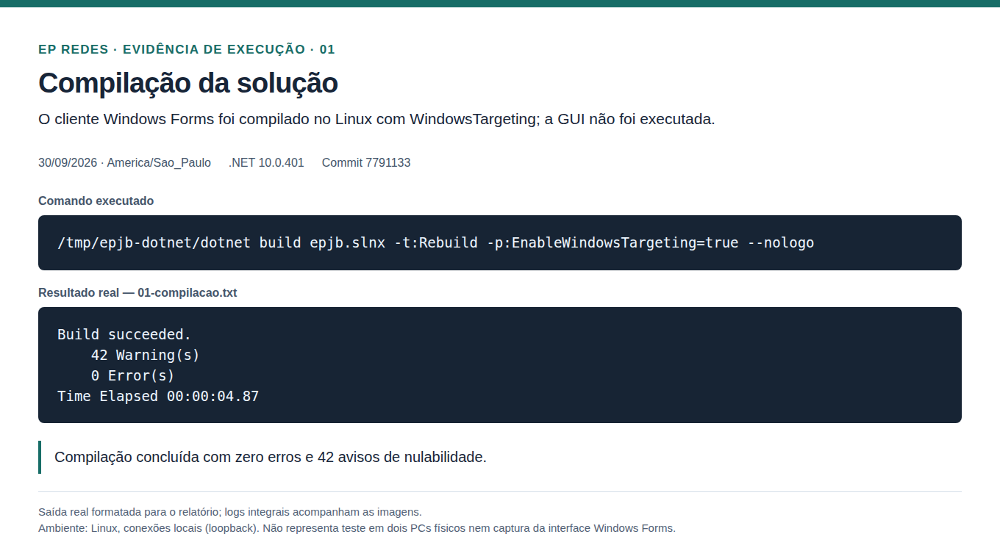
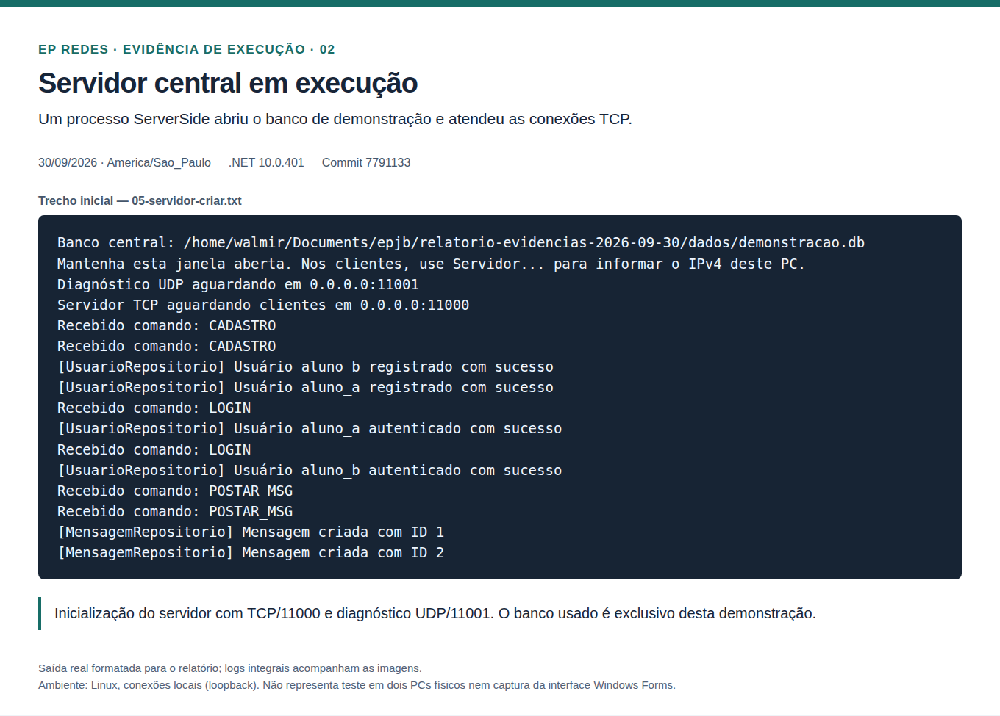
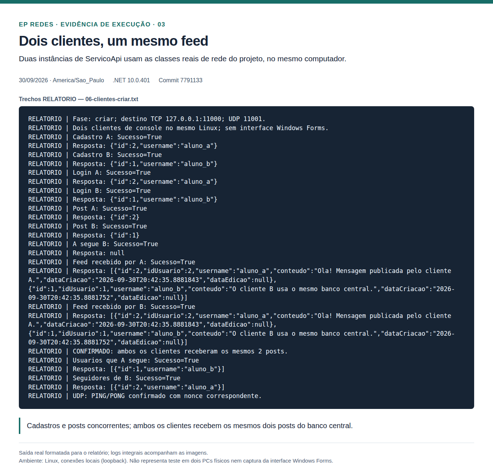
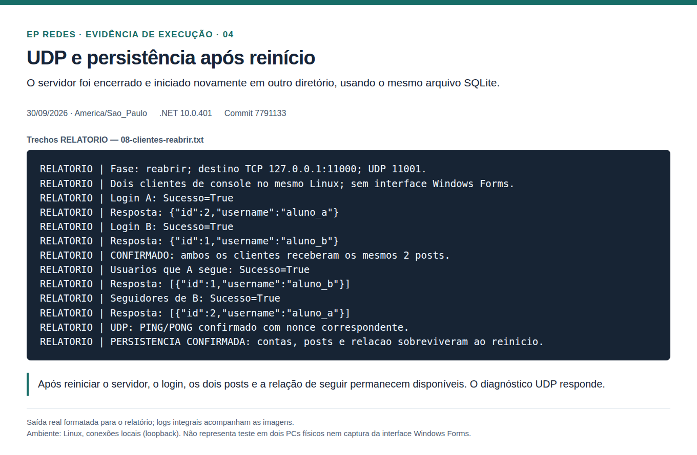
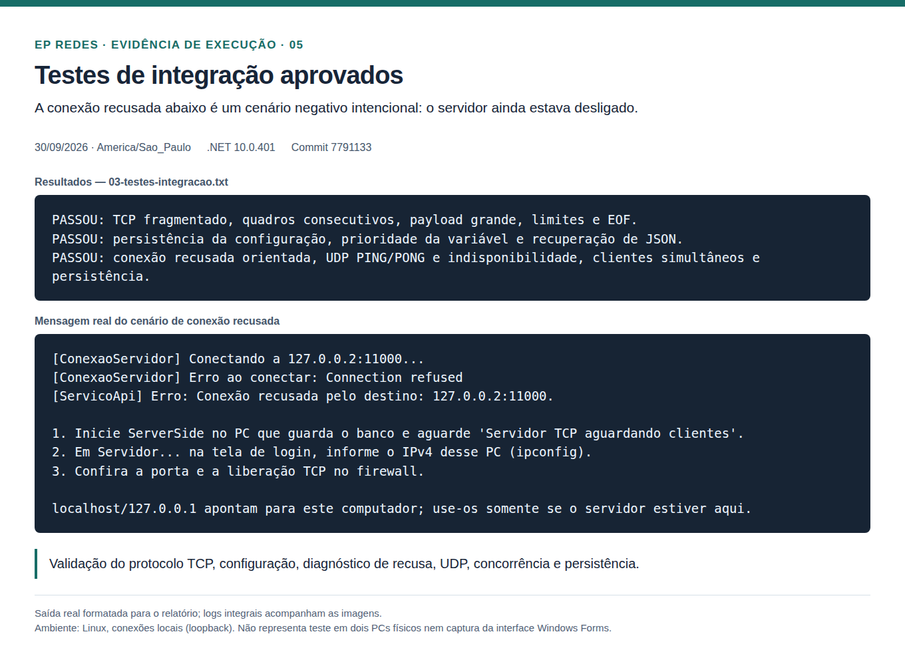

# Evidências de execução — Twitter Simplificado

Resultados coletados em **30/09/2026**, no Linux x86_64, com **.NET SDK 10.0.401**.
Código testado: [`7791133`](https://github.com/Pedrolbtb/EP-Redes-Twitter/commit/7791133a12d9870b3dfbcc08f1319ac6fe0ba1e7), do [PR #1](https://github.com/Pedrolbtb/EP-Redes-Twitter/pull/1).

**Estas evidências correspondem ao código do PR #1, ainda aberto na publicação
deste registro, e não à versão anterior de `master`.** Este PR de documentação
não altera nem incorpora a implementação do servidor/cliente.

## Resultados

| Verificação | Resultado | Evidência integral |
| --- | --- | --- |
| Recompilação da solução | 0 erros; 42 avisos de nulabilidade | [Compilação](logs/01-compilacao.txt) |
| Compilação dos testes | Aprovada | [Build dos testes](logs/02-compilacao-testes.txt) |
| Framing TCP, configuração, conexão recusada, UDP e integração | Aprovados | [Teste de integração](logs/03-testes-integracao.txt) |
| Compilação do cliente de console da demonstração | Aprovada | [Build da demonstração](logs/04-compilacao-demonstracao.txt) |
| Inicialização TCP/UDP e atendimento | Aprovados | [Servidor](logs/05-servidor-criar.txt) |
| Dois cadastros e posts concorrentes; login; feed comum; seguir e seguidores | Aprovados | [Clientes](logs/06-clientes-criar.txt) |
| Reinício do servidor em outro diretório | Aprovado | [Servidor após reinício](logs/07-servidor-reabrir.txt) |
| Dados preservados e PING/PONG UDP após reinício | Aprovados | [Clientes após reinício](logs/08-clientes-reabrir.txt) |
| Registros no arquivo central | 2 usuários, 2 posts e 1 relação de seguir | [Consulta SQLite](logs/09-banco-central.json) |

## Escopo das evidências

O servidor real `ServerSide` executou em processo separado. Duas instâncias de
`ServicoApi` usaram as mesmas classes de rede/protocolo do cliente Windows Forms,
com um banco exclusivo da demonstração. O servidor foi encerrado e reiniciado
em outro diretório de trabalho usando o mesmo caminho de banco.

As conexões utilizaram loopback na mesma máquina Linux. **Não houve execução da
interface Windows Forms nem teste entre dois PCs físicos.** A interface foi
compilada com `EnableWindowsTargeting=true`. A validação da GUI, dos atalhos `.cmd`
e da rede entre dois computadores Windows permanece pendente.

Os processos de demonstração foram encerrados após a coleta e o banco original
do projeto foi preservado. O arquivo SQLite e binários de compilação não são
incluídos nesta pasta; a consulta JSON contém apenas os dados demonstrados, sem
senhas. Os logs preservam caminhos e horários reais da execução.

## Imagens e legendas para o relatório

As imagens são **capturas de páginas HTML com saídas reais formatadas**, não
capturas de uma janela de terminal nem da GUI. Os trechos foram selecionados dos
logs indicados em cada imagem, sem modificar os valores retornados.

### 1. Compilação

Recompilação da solução com suporte de compilação Windows no Linux, concluída
sem erros e com 42 avisos de nulabilidade.



### 2. Servidor central

Inicialização do banco de demonstração, escuta TCP na porta 11000 e diagnóstico
UDP na porta 11001; atendimento de cadastro, login e publicação de mensagens.



### 3. Dados compartilhados

Dois clientes de console cadastram usuários e publicam mensagens concorrentes.
Ambos recebem os mesmos dois posts do banco central. A relação de seguir é
consultada nos dois sentidos.



### 4. Persistência e UDP

Após encerrar e reiniciar o servidor, as contas, mensagens e relação de seguir
continuam acessíveis. O diagnóstico confirma PING/PONG UDP com nonce correspondente.



### 5. Testes automatizados

Testes aprovados de framing TCP, configuração, conexão recusada, UDP, concorrência
e persistência. A recusa mostrada é intencional e faz parte do cenário com servidor
desligado.



## Texto sugerido para o relatório

> Os testes foram executados em ambiente Linux com .NET 10. O servidor foi iniciado
> em processo separado e dois clientes de console utilizaram a camada de rede do
> projeto para cadastrar usuários e publicar mensagens de forma concorrente. Os
> dois clientes receberam o mesmo conjunto de posts, confirmando o compartilhamento
> do banco central. A relação de seguir foi consultada nos dois sentidos. Após
> reiniciar o servidor com o mesmo arquivo SQLite, os dados continuaram disponíveis.
> Também foram validados o enquadramento das mensagens TCP, o diagnóstico de conexão
> recusada e a troca PING/PONG UDP. A compilação terminou sem erros, com 42 avisos de
> nulabilidade. Os testes utilizaram loopback em uma única máquina; a interface
> Windows Forms e a comunicação entre dois PCs físicos ainda precisam de validação
> no ambiente Windows.

## Reprodução e rastreabilidade

[ambiente.json](ambiente.json) registra SDK, sistema, horário e SHA do código.
[SHA256SUMS.txt](SHA256SUMS.txt) permite conferir a integridade dos arquivos desta
pasta. [demonstracao/Program.cs](demonstracao/Program.cs) contém o cliente de console
que produziu os registros `RELATORIO`; ele referencia os fontes de rede do projeto.

Para reproduzir a suíte de integração, use o código do PR #1 (commit indicado acima
ou uma versão posterior que o contenha) e execute na raiz do repositório:

```bash
dotnet build epjb.slnx -t:Rebuild -p:EnableWindowsTargeting=true --nologo
dotnet build tests/Integracao --nologo
dotnet tests/Integracao/bin/Debug/net10.0/Integracao.dll "$PWD/ServerSide/bin/Debug/net10.0/ServerSide.dll"
```

As portas 11000/TCP e 11001/UDP devem estar livres. A suíte cria e remove seu próprio
banco temporário.

Para repetir a demonstração adicional, em uma cópia que contenha tanto esta pasta
quanto o código do PR #1, compile `docs/evidencias/2026-09-30/demonstracao`. Inicie
`ServerSide` em outro terminal com `EPJB_DB_PATH` apontando para um **novo banco de
teste**, execute a DLL da demonstração com argumento `criar`, encerre/reinicie o
servidor com o mesmo banco e execute a demonstração com argumento `reabrir`.
O cliente usa `127.0.0.1` e as portas padrão. Não reutilize um banco com contas reais:
a fase `criar` registra as contas fictícias `aluno_a` e `aluno_b`.

Para conferir os hashes no Linux, execute dentro desta pasta:

```bash
sha256sum -c SHA256SUMS.txt
```
